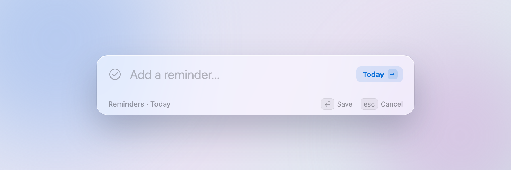
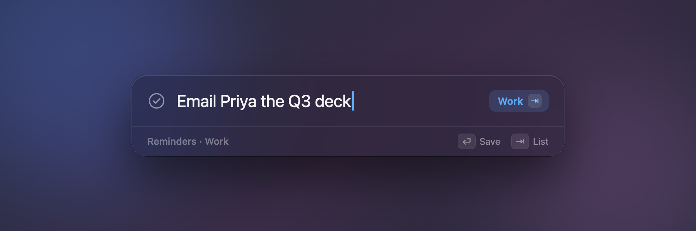

# Kivodo

A macOS menu bar app for capturing todos into Apple Reminders. Press a global
shortcut from any app and a floating box appears over whatever is on screen —
type a todo, hit Enter, and it lands in Reminders. The panel disappears and
focus returns to what you were doing.





It borrows the interaction from the ChatGPT desktop app's quick-entry box: a
frosted panel that floats above everything without stealing focus from the app
you're in.

Kivodo is capture-only. Viewing, editing, and completing reminders happens in
Apple Reminders, which also syncs them to your other devices over iCloud.

## Features

- **Global shortcut** opens the capture panel from anywhere, including over
  full-screen apps and on any Space. Default is ⌥ Space; change it in Settings.
- **Non-activating panel** — the app you're in keeps visual focus while you type.
  It follows you across Spaces and only closes on Escape, a click outside, the
  shortcut again, or a successful save.
- **Saves to Apple Reminders** via EventKit, no account or network of its own.
- **Destination toggle** — pick two lists (e.g. Personal and Work) in Settings
  and switch between them with Tab or a click while the panel is open.
- **Lives in the menu bar** with no Dock icon and no main window.
- **Updates itself** through Sparkle. New versions are picked up in the
  background; "Check for Updates…" in the menu triggers a check on demand.

## Requirements

- macOS 14 or later
- Xcode 16 / a Swift 6 toolchain (to build)

## Build and run

```sh
make run
```

This builds a release binary, assembles `build/Kivodo.app`, ad-hoc signs it,
and launches it. A checkmark icon appears in the menu bar. On first capture,
macOS asks for Reminders access.

Other targets:

```sh
make app     # build and sign build/Kivodo.app without launching
make test    # run the unit tests
make clean    # remove build artifacts
```

You can also open `Package.swift` in Xcode and run from there.

## Usage

1. Press the shortcut (⌥ Space by default) to open the panel.
2. Type a todo and press Enter. Escape, clicking outside, or pressing the
   shortcut again dismisses it without saving.
3. Open **Settings** (⌘, from the menu bar item) to change the shortcut or pick
   your two destination lists.

If the shortcut does nothing, another app already owns that combination
globally — the ChatGPT app claims ⌥ Space, and macOS reserves ⌘ Space and
⌃ Space. Pick a different combination in Settings.

## Project layout

The code splits into a testable core library and a thin app target:

- **`KivodoCore`** — no UI dependencies, unit-tested. Holds `CaptureViewModel`
  (input handling, destination selection, save orchestration), the
  `ReminderStore` protocol, and `EventKitReminderStore`.
- **`Kivodo`** — the executable: `MenuBarExtra` app, the floating `NSPanel`,
  the SwiftUI capture and settings views, and the panel controller.

Two third-party dependencies:
[KeyboardShortcuts](https://github.com/sindresorhus/KeyboardShortcuts) for the
shortcut recorder and permission-free global hotkey registration, and
[Sparkle](https://github.com/sparkle-project/Sparkle) for auto-updates. Sparkle
sits behind a build flag: `KIVODO_MAS=1` drops it, for a future App Store build
where the store handles updates.

The app icon lives in [`Assets/icon`](Assets/icon): three SVG masters and a
`make-icns.sh` generator. `Kivodo.icns` is built from the frosted-panel master
(a miniature of the capture panel) and bundled by `make app`; run `make icon`
to regenerate it after editing the master.

Design notes and the implementation history live in [`docs/plans`](docs/plans).

## Updates and releases

Releases are automated by [`.github/workflows/build.yml`](.github/workflows/build.yml).
Every push to `main` builds the app, signs it with a Developer ID certificate,
notarizes it with Apple, and publishes a GitHub release. The workflow then
generates a Sparkle appcast, signs the download with an EdDSA key, and commits
`appcast.xml` back to `main`. Installed copies read that appcast from
`raw.githubusercontent.com`, so **the repository has to stay public** for
updates to reach users. Pull requests only run the build, skipping the signing
and release steps.

The marketing version comes from the top `## [X.Y.Z]` heading in
[`CHANGELOG.md`](CHANGELOG.md); the build number is the workflow run number.

Signing and notarization need seven repository secrets
(Settings → Secrets and variables → Actions):

| Secret | What it is |
|---|---|
| `DEVELOPER_ID_CERTIFICATE_BASE64` | Developer ID Application certificate (`.p12`), base64-encoded |
| `DEVELOPER_ID_CERTIFICATE_PASSWORD` | Password for that `.p12` |
| `APPLE_API_KEY_BASE64` | App Store Connect API key (`.p8`), base64-encoded |
| `APPLE_API_KEY_ID` | Key ID for that API key |
| `APPLE_API_ISSUER_ID` | Issuer ID for the API key |
| `APPLE_TEAM_ID` | Apple Developer team ID |
| `SPARKLE_PRIVATE_KEY` | Sparkle EdDSA private key that signs update downloads |

The matching Sparkle public key is pinned in the app's `Info.plist` as
`SUPublicEDKey`; the private key must never change, or existing installs can no
longer verify updates.

## License

Personal project; no license specified.
